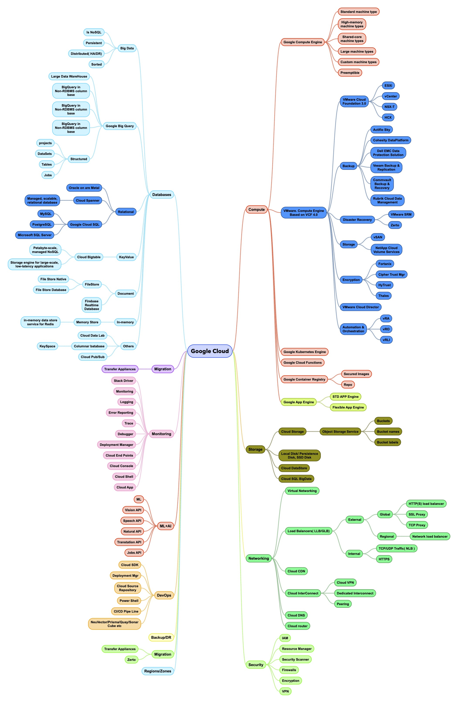

# GCP-Spider
Diferent components of Google cloud environment in a single dashboard
This mindmap draws most of the segments of GCP.
This is not a complete list, but list of common used services.
The common Services are divided into areas and available services from GCP
#### Compute( GCE,GKE,GAE,VMware,Cloud Functions)
#### Storage
#### Networking
#### Security
#### Databases
#### ML/AI
#### DevOps

